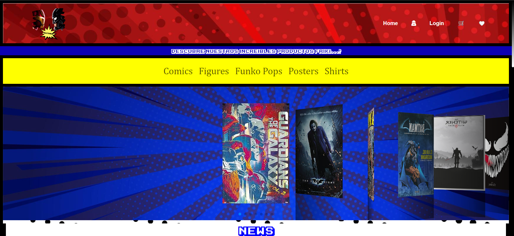
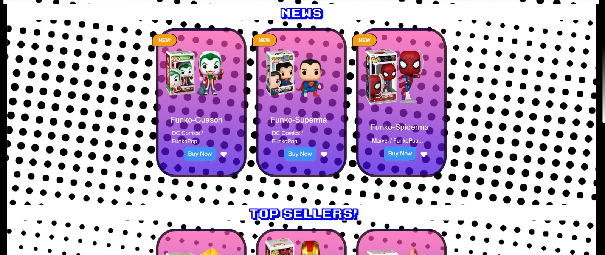
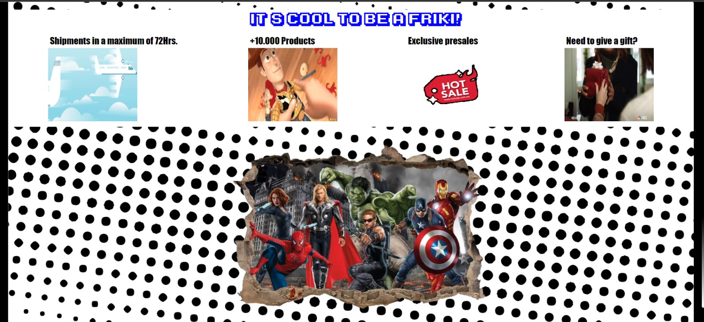
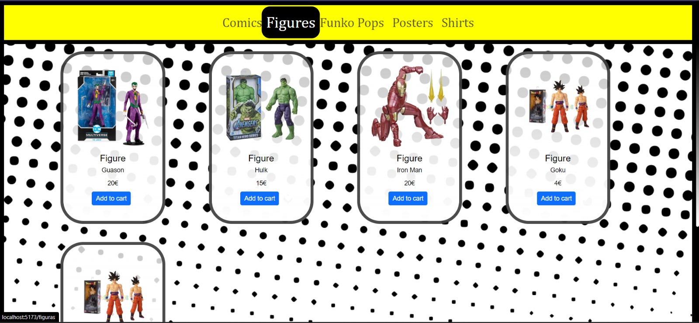
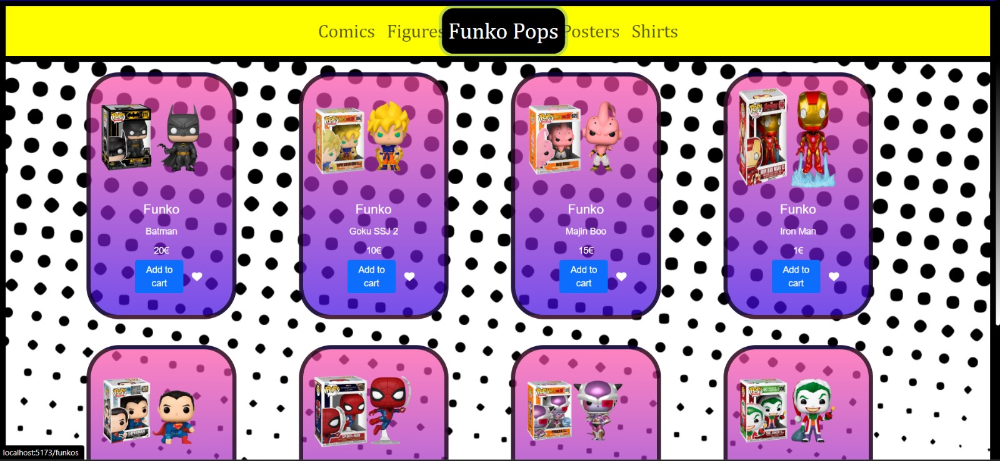
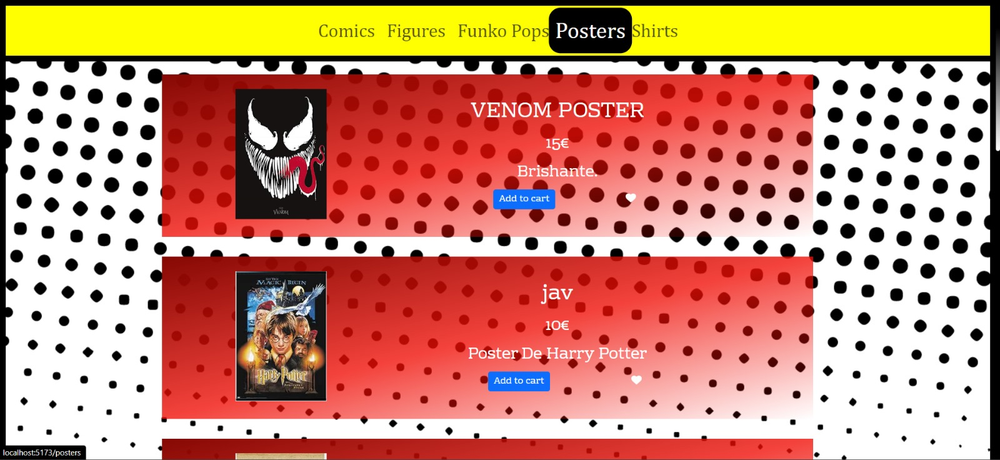
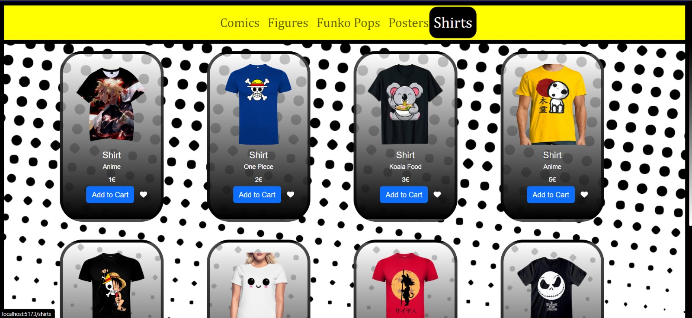
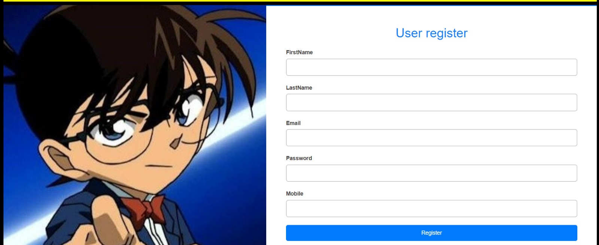
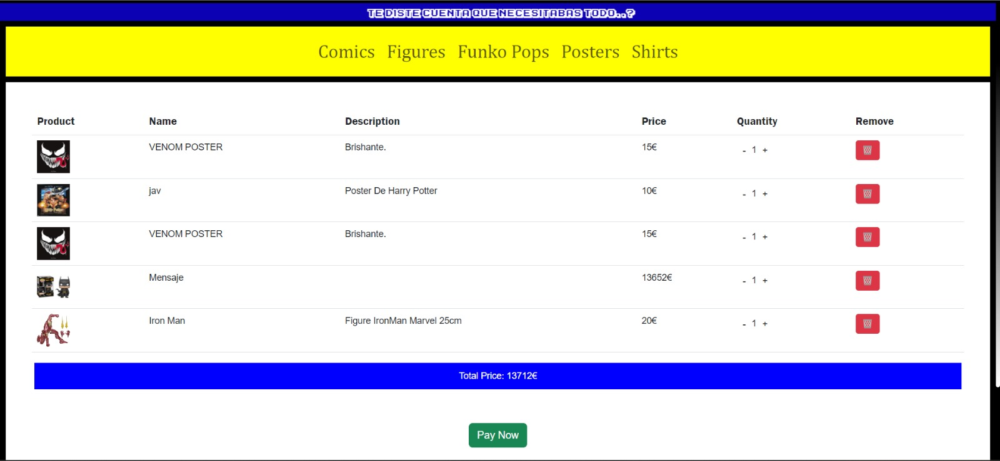

  

## Project Description 🚀

Multiverse is an e-commerce website designed to effectively sell merchandise products and provide customers with a satisfying shopping experience. It's a design and development project with a free theme in which we will be working on both the Front-end and Back-end. This repository contains the Front-end files along with the development of a fake API that allows us to work on the application without relying on real data or external system connections.

## Screenshots 📷

## Stacks 🖥️
● Visual Studio Code  
● React  
● Frameworks  
● Bootstrap  
● JavaScript  
● CSS  
● HTML  
● Cloudinary  
● GitHub  
● Trello  
● Figma  
● Slack  
● Zoom

## Libraries 📚

## Technologies and Tools 🔨

  
  
  
  
  
  
  
  
  
  

## Tech Stack 🛠️

## Methodology 📚

● Mob, pair and solo programming  
● Agile with Scrum & Trello  
● Testing  
● We work with branches: 6 working branches were used on GitHub to manage the workflow:  
- Main: This branch contains functional and stable code. It is the main and/or final branch.  
- Dev: It's the branch where different working codes are integrated into one and where preliminary testing is done before production. It's an intermediate and/or safety branch.  
- Independents: These are different branches where each team member develops their code according to assigned tasks for later merging into the Dev branch. It's an independent and/or testing branch.  
+ The branch methodology allows us to work collaboratively and maintain an organized and efficient workflow. Furthermore, working in branches allows us to work freely without conflicting with the work of other team members. Additionally, it provides us with greater control and a record or history of the various changes being made. On the other hand, for added security when merging codes from different branches, we have implemented security rules on GitHub where it is necessary to create a pull request prior to the merge.

## Tests ☑️

## Tests Screenshots (Coming Soon) ✔️

**We're working on it!**  

Screen images will be available here shortly. Stay tuned!  

## Installation Process ⬆️

1. Clone the GitHub repository: https://github.com/miguelcidoncha/Multiverse-Proyect
2. Open the file using Visual Studio Code.
3. Open the terminal in Visual Studio Code.
4. Install the following command: **npm i.**
5. Once the component installations are complete, in a new terminal, run **npm run dev**. Open the **localhost**: that appears.
6. In a new terminal, run the command **json-server --watch cards.json**. Open the **localhost**: that appears.
7. Now you can view not only the static Front-end web page but also add, modify, and delete the content of the cards through the Fake API.

## Next Steps 🔜
Coming soon, we will continue developing the Full Stack project with the repository https://github.com/miguelcidoncha/Multiverse-Back-end. The goal is to be able to work with both this Front-end repository and the Back-end repository, thus creating a fully functional e-commerce website where we will combine both the visual and the database aspects.

## Authors 👨‍💻👩‍💻

| [ Laura Barrero](https://github.com/laurabarrerogonzalez) | [ Rebeca Poma](https://github.com/rebecapoma6) | [ Javier Serrano](https://github.com/JaviSeC) | [ Miguel Cidoncha](https://github.com/miguelcidoncha) |
| :---: | :---: | :---: | :---: |

